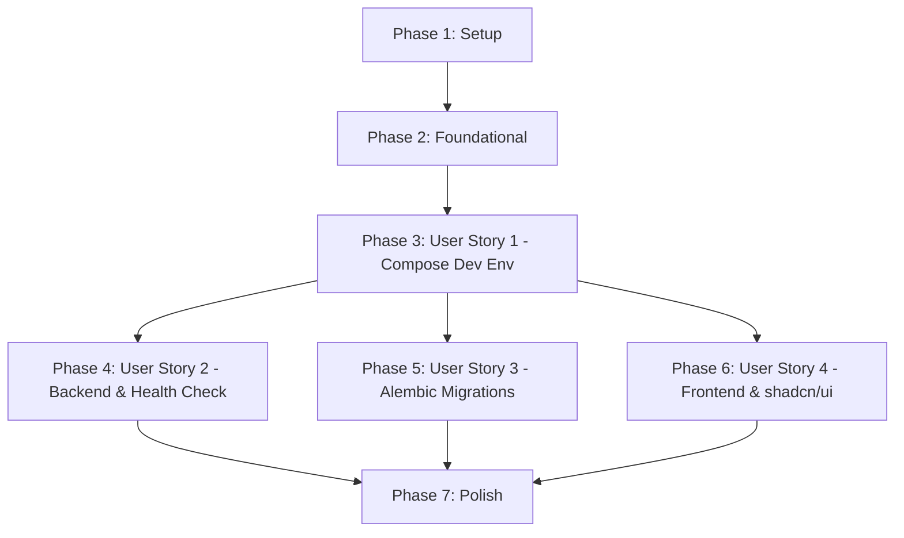

# Tasks: Project Foundation Setup

**Input**: Design documents from `/specs/001-foundation-setup/`

**Prerequisites**: plan.md (required), spec.md (required for user stories), research.md, data-model.md, contracts/

**Organization**: Tasks are grouped by user story to enable independent implementation and testing of each story.

## Format: `[ID] [P?] [Story] Description`

- **[P]**: Can run in parallel (different files, no dependencies)
- **[Story]**: Which user story this task belongs to (e.g., US1, US2, US3)
- Include exact file paths in descriptions

## Path Conventions

- Monorepo structure uses `backend/app/`, `frontend/app/`, and `nginx/` directories.

---

## Phase 1: Setup (Shared Infrastructure)

**Purpose**: Project initialization and basic structure

- [x] T001 Create project directories (`backend/`, `frontend/`, `nginx/`) at repository root
- [x] T002 Create root environment template file `.env.example`
- [x] T003 [P] Configure root-level `.gitignore` file

---

## Phase 2: Foundational (Blocking Prerequisites)

**Purpose**: Core Docker, package, and proxy configuration that MUST be complete before ANY user story can be implemented

**⚠️ CRITICAL**: No user story work can begin until this phase is complete

- [x] T004 Setup backend Python dependencies in `backend/requirements.txt`
- [x] T005 Create backend container description in `backend/Dockerfile`
- [x] T006 Create frontend container description in `frontend/Dockerfile`
- [x] T007 [P] Create local Nginx reverse proxy configuration at `nginx/nginx.conf`
- [x] T008 Create multi-container Docker orchestrator file `docker-compose.yml`

**Checkpoint**: Foundation ready - user story implementation can now begin

---

## Phase 3: User Story 1 - Local Development Environment Initialization (Priority: P1) 🎯 MVP

**Goal**: Start all 8 core development services via Docker Compose.

**Independent Test**: Copy `.env.example` to `.env`, run `docker compose up -d`, and verify that all containers boot successfully.

### Implementation for User Story 1

- [/] T009 [US1] Build and start all orchestrated dev containers via `docker compose up -d --build`
- [/] T010 [US1] Verify active running container statuses via `docker compose ps`

**Checkpoint**: At this point, the local multi-service container environment is fully operational and testable.

---

## Phase 4: User Story 2 - Backend Application Bootstrap and Health Checking (Priority: P1)

**Goal**: Establish a FastAPI application containing a `/health` endpoint that checks connection integrity to PostgreSQL, Redis, and ChromaDB.

**Independent Test**: Send a GET request to the `/health` endpoint and verify the returned service status payload matches the schema in `contracts/health-check.json`.

### Implementation for User Story 2

- [ ] T011 [US2] Create FastAPI app factory and entrypoint at `backend/app/main.py`
- [ ] T012 [US2] Create PostgreSQL database session provider at `backend/app/db/session.py`
- [ ] T013 [US2] Create Redis connection client wrapper at `backend/app/core/redis_client.py`
- [ ] T014 [US2] Create ChromaDB HTTP client connection at `backend/app/services/rag/chroma_client.py`
- [ ] T015 [US2] Implement health check router and check logic at `backend/app/api/v1/health.py`
- [ ] T016 [US2] Register health check router in the API routing table at `backend/app/api/v1/router.py`
- [ ] T017 [US2] Validate health check endpoint response against `contracts/health-check.json` schema using Curl

**Checkpoint**: At this point, the backend is bootstrapped and database/cache connection checking is functional.

---

## Phase 5: User Story 3 - Database Migration Initialization (Priority: P1)

**Goal**: Setup Alembic migrations framework and run the initial migration script to build all 7 core tables.

**Independent Test**: Run migrations inside the backend container and verify database schema table list.

### Implementation for User Story 3

- [ ] T018 [US3] Initialize Alembic settings at `backend/alembic.ini` and configuration folder at `backend/alembic/`
- [ ] T019 [US3] Create database models import registry file at `backend/app/db/base.py`
- [ ] T020 [US3] Create model definition files for all tables under `backend/app/models/`
- [ ] T021 [US3] Configure metadata imports inside migrations setup file `backend/alembic/env.py`
- [ ] T022 [US3] Generate initial table schemas migration file using `docker compose exec backend alembic revision --autogenerate`
- [ ] T023 [US3] Execute DB schema migration scripts via `docker compose exec backend alembic upgrade head`

**Checkpoint**: At this point, database migrations are initialized, and the core tables exist in the Postgres database.

---

## Phase 6: User Story 4 - Frontend Bootstrap with Component Library (Priority: P2)

**Goal**: Initialize a Next.js 14 project using App Router and configure it with shadcn/ui.

**Independent Test**: Load the frontend page in a browser and verify correct UI rendering.

### Implementation for User Story 4

- [ ] T024 [US4] Scaffold Next.js 14 App Router project under `frontend/`
- [ ] T025 [US4] Configure build scripts inside `frontend/package.json`
- [ ] T026 [US4] Initialize shadcn/ui components configuration at `frontend/components.json`
- [ ] T027 [US4] Add and import a shadcn Button component in `frontend/app/page.tsx`
- [ ] T028 [US4] Verify web rendering of local frontend container by accessing `http://localhost:3000`

**Checkpoint**: At this point, the frontend skeleton is bootstrapped and shadcn/ui is ready to style components.

---

## Phase 7: Polish & Cross-Cutting Concerns

**Purpose**: Cleanup, documentation, and final validation

- [ ] T029 Create repository documentation file `README.md` detailing the quickstart guide
- [ ] T030 Verify developer setup instructions documented in `specs/001-foundation-setup/quickstart.md`

---

## Dependencies & Execution Order

### Phase Dependencies

- **Setup (Phase 1)**: No dependencies - starts immediately.
- **Foundational (Phase 2)**: Depends on Setup (Phase 1) - blocks all user stories.
- **User Stories (Phases 3–6)**: Depend on Foundational (Phase 2) completion.
  - User Story 1 (Phase 3) must run first to start containers.
  - User Story 2 (Phase 4), User Story 3 (Phase 5), and User Story 4 (Phase 6) can be developed in parallel once containers are up.
- **Polish (Phase 7)**: Depends on all User Story phases being completed.



### Parallel Opportunities

- Within **Phase 1**, T003 can run in parallel with T001/T002.
- Within **Phase 2**, T007 (Nginx proxy) can be written in parallel.
- Once **Phase 3** (Docker Compose running) completes, developers can concurrently implement:
  - Backend API + Health checks (Phase 4)
  - DB Models + Alembic schema definitions (Phase 5)
  - Next.js scaffolding + shadcn setup (Phase 6)

---

## Parallel Example: User Story 2 & 4

```bash
# Developer A configures the backend connection helpers:
Task: "Create PostgreSQL database session provider at backend/app/db/session.py"
Task: "Create Redis connection client wrapper at backend/app/core/redis_client.py"

# Developer B configures the frontend scaffolding:
Task: "Scaffold Next.js 14 App Router project under frontend/"
Task: "Configure build scripts inside frontend/package.json"
```

---

## Implementation Strategy

### MVP First (User Story 1 Only)

1. Complete Setup and Foundational files.
2. Spin up containers using `docker compose up -d`.
3. Verify all 8 core service containers are running successfully.

### Incremental Delivery

1. Bootstrap dev environment (US1).
2. Establish API skeleton and health check (US2).
3. Initialize base schemas and tables (US3).
4. Bootstrap user interface skeleton (US4).
5. Document developer commands (Polish).
